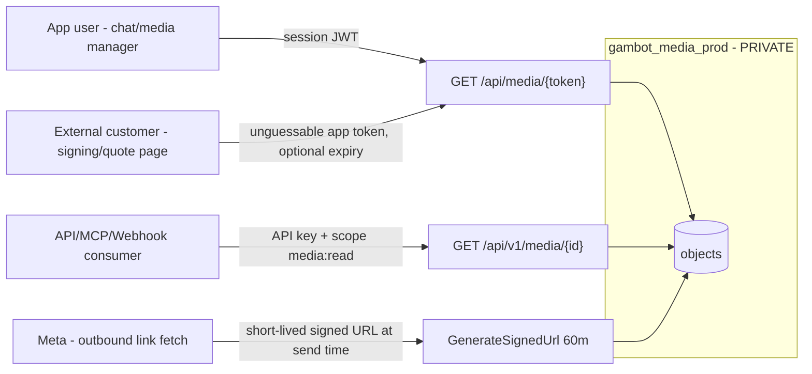

# Gambot Media Security Audit & Private-Bucket Migration Plan

> Scope: every place Gambot **stores or shares media/files**, why the storage
> bucket is public today, whether it *needs* to be, and a concrete plan to make
> it private (signed URLs + a media-token proxy) — including the API/MCP webhook
> "can't download the image" gap.
>
> Evidence-based (file:line citations throughout). Nothing here was changed in
> code yet — this is the map + the proposal.

---

## 0. TL;DR (executive summary — עברית)

- **הבאקט `gambot_media_prod` פומבי לגמרי** (public read ברמת ה‑bucket / IAM `allUsers`). כמעט כל
  המדיה של המוצר (הודעות נכנסות/יוצאות, הצעות מחיר, מסמכים, חתימות, מדיה־מנג'ר, הקלטות, לוגו, קבצי
  טבלאות, מסמכי עובדים) נשמרת שם ומוחזרת כ‑`https://storage.googleapis.com/gambot_media_prod/...` —
  קישור פומבי ללא שום הרשאה, ללא תפוגה, ללא אפשרות ביטול, ללא בידוד בין ארגונים.
- **האם צריך שזה יהיה פומבי בשביל וואטסאפ? לא.** וואטסאפ מושך את המדיה **רק ברגע השליחה** (Meta מטמינה
  ל‑10 דק'). לשליחה חוזרת משתמשים ב‑media **id**, לא בקישור פומבי קבוע. כלומר **קישור חתום קצר‑מועד (signed URL)
  מספיק לחלוטין** גם לשליחה וגם ל"שיישאר" (מטא כבר החזיקה עותק; הצפייה ההיסטורית באפליקציה עוברת דרך פרוקסי מאובטח).
- **הבעיה השנייה (webhook/API לא מצליח להוריד תמונה):** ה‑webhook מעביר את ה‑payload הגולמי של מטא עם
  media **id** בלבד (או URL של מטא שדורש Bearer token ותפוג אחרי 5 דק'). לכן המקבל לא יכול להוריד. הפתרון:
  להוסיף **מזהה מדיה יציב (`gmbt_mediaId`) + endpoint** `GET /api/v1/media/{id}` שמוריד לפי הרשאת API‑key
  (מוריד מ‑Meta on‑demand אם עוד לא נשמר, ומחזיר signed URL / stream), ולהזריק את הקישור הזה לתוך ה‑webhook.
- **התשתית לחתימה כבר קיימת** (`GenerateSignedUrl`, FirebaseService.cs:64494) — היום בשימוש רק לבאקט הפרטי
  `gambot_ai_knowledgebase`. נרחיב אותה לכלל המדיה.

---

## 1. Current media architecture (mapped)

### 1.1 Buckets

| Bucket | Purpose | Access today |
|--------|---------|--------------|
| **`gambot_media_prod`** | **Primary CRM media** — inbound/outbound WhatsApp media, quotes, doc-templates, e-signatures, media-manager, catalog, recordings, employee docs, email/template media, botomation media | **Public read (bucket-level)** |
| `gambot_ai_knowledgebase` | AI knowledge-base files | **Private** (signed URLs, 2 min) |
| `gambot_src` | Static logos, TTS audio, marketing assets | Public |
| `gambot-c2e88.appspot.com` | Legacy email-template media | Public |
| `flow_json` | Form-flow JSON | `gs://` refs |
| `gambot-media` / config | IVR audio fallback | Public |
| `gambot-a383d.appspot.com` | Firebase default (config only, ~unused by uploads) | n/a |

**Init:** singleton `StorageClient` from `GOOGLE_CLOUD_BUCKET_CREDENTIALS` (FirebaseService.cs:4778–4856).

**Key finding — no per-object ACL in code.** Searches for `PredefinedObjectAcl`, `PublicRead`,
`MakePublic`, `.Acl` return **zero matches**. Uploads set only bucket+name+contentType
(`UploadMediaToBucket`, FirebaseService.cs:44860). Public access therefore comes from
**bucket-level IAM (`allUsers:objectViewer`) / uniform bucket-level access** — i.e. the whole
bucket is world-readable. Public URLs are built by pure string concat:

```44480:44483:c:\Users\NirSegas\source\repos\Gambot-BE\gmbt_backend\Gambot-BE\Services\FirebaseService.cs
public async Task<string> GetPublicUrl(string bucketName, string objectName)
{
    return $"https://storage.googleapis.com/{bucketName}/{objectName}";
}
```

### 1.2 Who uploads (surfaces that WRITE media)

All client uploads are **backend-mediated multipart POSTs** (no Firebase Storage client SDK is
used anywhere in frontend/website/mobile — Firebase there is Auth+Firestore only). Representative
endpoints (all land in `gambot_media_prod` and return a public URL):

| Feature | Endpoint | Object path |
|---------|----------|-------------|
| Inbound WhatsApp media | (webhook) `InboundMessage` | `Organizations/{org}/Messages/{from}/{mediaId}.{ext}` |
| Outbound chat media | `CreateWabaMediaMessages` | `Organization/{org}/Messages/{phone}/{file}` |
| Quote PDF | client builds PDF → `CreateWabaMediaMessages`; URL saved as `quoteFileUrl` | `.../Messages/{phone}/...` |
| Document templates | `DocTemplates_UploadPdf` | `Organization/{org}/DocumentTemplates/{guid}/` |
| E-signatures | `ESignature_UploadFile` / create | `.../ESignatures/{docId}/` |
| Template/broadcast header | `CreateWabaMedia` | `Organization/{org}/Templates/{file}` |
| Media Manager / catalog / forms | `UploadMediaFile` | `.../MediaManager/...` |
| Company logo | `UploadCompanyLogo` | `.../company-logo-...` |
| Employee HR docs | `UploadEmployeeDocument` | `.../employees/{id}/` |
| Custom-table files | `UploadTableFile` | `customtables/{tableId}/{recordId}/media/` |
| Email-template media | `email-templates/upload-media` | `.../EmailTemplates/media/` |
| Call recordings | `UploadCallRecording` / Twilio | `.../Recordings/...` |
| Botomation/AI media | `UploadBotomationMedia` | `.../BotomationMedia/...` |
| **Demo builder (anonymous!)** | `POST /api/Demo/upload-media` `[AllowAnonymous]` | `Organizations/gambot/DemoMedia/` |

### 1.3 Who reads / shares media (surfaces that EXPOSE a URL)

| Consumer | Auth context | URL used today |
|----------|--------------|----------------|
| Frontend/mobile app (chat images, media manager, quote preview) | Logged-in session | raw public GCS URL in `` |
| `GET /api/v1/conversations/{phone}/messages` (`mediaUrl`) | API key | raw public GCS URL |
| WhatsApp **outbound by link** (botomation/AI, and audio in chat) | Meta fetch, no auth | raw public GCS URL passed as `image.link` etc. |
| WhatsApp **outbound by id** (chat UI images/docs/video) | — | bytes uploaded to Meta `/media`; GCS URL only stored for app display |
| Public signing/form pages (external customer) | App token in link | doc `fileUrl` (public GCS) + app-route token |
| Quote sent to customer | via WhatsApp | PDF delivered through Meta |
| Webhook forwarding to customer | API key registration | **Meta `image.id` only — no downloadable URL** |

### 1.4 WhatsApp media, precisely

- **Outbound "by id" (chat UI):** upload GCS → re-POST bytes to Meta `/media` → send `image.id`
  (FirebaseService.cs `CreateMedia` 26439; GambotController.cs 19830). **Public bucket irrelevant here.**
- **Outbound "by link" (botomation/AI + audio):** `SendImageMessageAsync` etc. send
  `image.link = EncodeMediaLink(publicGcsUrl)` (Waba.cs:684). **Meta fetches the URL at send time only.**
- **Inbound:** Meta webhook gives `image.id` (+ 5-min `url` on coexistence). Backend downloads with
  Bearer token → uploads to `gambot_media_prod` → stores public `mediaUrl` (FirebaseService.cs:23558–23620).

**Confirmed via Meta docs:** media-by-link is cached 10 min; resend should use media id, not a
persistent public URL. Inbound media URL expires in 5 min; media id downloadable for **7 days**.
→ **A short-lived signed URL fully satisfies WhatsApp. Public-forever is not required.**

### 1.5 The webhook download gap (problem #2), precisely

`ProcessIncomingRequest` fires forwarding **fire-and-forget** (WabaInboundUrlController.cs:433)
**before** media is downloaded. The envelope embeds Meta's **raw** payload:

```json
{ "type":"incoming_message", "organization":"...", "receivedAt":"...",
  "meta_obj": { "entry":[{"changes":[{"value":{"messages":[
     { "type":"image", "image": { "id":"<waba-media-id>", "mime_type":"image/jpeg" } }
  ]}}]}] } }
```

The receiver gets a Meta **media id** (and sometimes a 5-min token-gated Meta URL) — **never** a
Gambot downloadable URL. There is no v1 route like `GET /media/{id}` today (only
`POST /templates/media` exists). **This is the root cause of "the webhook can't download the image."**

---

## 2. Risk assessment of the current public bucket

| Risk | Detail |
|------|--------|
| **No revocation** | A public GCS URL works forever once leaked; you can't invalidate a single share. |
| **No expiry** | Sensitive PDFs (quotes, signed contracts, HR docs, ID scans) stay reachable indefinitely. |
| **No per-org isolation** | Anyone with a URL from any org can read it; paths are somewhat guessable (`Organization/{org}/Messages/{phone}/{file}`), enabling enumeration. |
| **No audit** | No record of who fetched an object. |
| **Anonymous write vector** | `POST /api/Demo/upload-media` is `[AllowAnonymous]` and returns public URLs (rate-limited by IP only). |
| **Whole-bucket exposure** | Public access is bucket-level, so *every* object — including unrelated internal artifacts — is world-readable. |

---

## 3. Target architecture — private bucket + signed access

Goal: **`gambot_media_prod` becomes private**, and every consumer gets media through a controlled
path that enforces auth, expiry, per-org scoping, and audit. Four access "lanes":



### Lane A — App users (chat, media manager, quote preview)
- Add **`GET /api/media/{mediaToken}`** (existing `[Authorize]` app auth). Validates the caller's org
  owns the object, then **302-redirects to a fresh 15-min signed URL** (or streams bytes).
- **`mediaToken`** = HMAC-signed, org-scoped, opaque reference to `{bucket, objectPath}` (no raw path leak).
- **Minimal frontend churn:** change `GetPublicUrl()` to return `https://api.gambot.co.il/media/{token}`
  instead of the raw GCS URL. Because the stored/returned field keeps the same *shape* (a URL string),
  existing `` / `mediaUrl` consumers keep working — they just hit the authenticated proxy.

### Lane B — API / MCP / Webhook consumers  (**directly solves problem #2**)
- Add **`GET /api/v1/media/{gmbt_mediaId}`** on an `ApiV1Base` controller, scope **`media:read`**.
  - Looks up the media/message record by `gmbt_mediaId` (or `messageId`) within `Org`.
  - If the object already exists in the bucket → return `302` to a fresh signed URL (or stream).
  - **If not yet downloaded** (webhook raced ahead) → download from Meta on-demand using the org's
    WABA token (valid for 7 days per Meta), store to bucket, then serve. Fully timing-proof.
- **Enrich the webhook envelope** so receivers get something downloadable immediately:
  ```json
  "media": {
    "gmbtMediaId": "<stable-id>",
    "mimeType": "image/jpeg",
    "downloadUrl": "https://api.gambot.co.il/api/v1/media/<stable-id>",
    "metaMediaId": "<waba-media-id>"
  }
  ```
  Add this block in `ForwardInboundToCustomerAsync` (WabaInboundUrlController.cs:325+) by parsing
  `meta_obj` for media messages and computing a stable `gmbtMediaId` (same scheme used when storing).
- Add MCP tool **`gambot_get_message_media`** (`GET /api/v1/media/{id}`) so GAMBA can fetch/relay
  incoming media. (Marked read-only in `inferAnnotations`.)

### Lane C — WhatsApp outbound by link (botomation/AI, audio)
- Before sending, if the URL is a `gambot_media_prod` object, mint a **short signed URL**
  (`GenerateSignedUrl(bucket, obj, 60)`) and pass that as `image.link`. Meta fetches within seconds;
  the bucket stays private. One helper call inside `SendImageMessageAsync`/`Video`/`Audio`/`Document`
  (Waba.cs) + `ExecuteSendMedia`/botomation senders. (For resend efficiency, prefer the media-id path.)

### Lane D — External customer pages (signing, forms, quote links)
- These are intentionally shared with a specific external customer, so keep an **unguessable,
  optionally-expiring app token** (already the model for signing pages via `ESignature_GetDocumentByToken`).
  Have those pages resolve the file through Lane A's proxy using their existing doc token rather than a
  raw GCS URL, so the underlying object stays private and the link is revocable.

### Shared building blocks
- **`GetMediaAccessUrl(objectPath, ttl)`** — new helper wrapping `GenerateSignedUrl` for `gambot_media_prod`.
- **`mediaToken` sign/verify** — HMAC(key=server secret) over `{bucket|object|org|exp?}`; base64url.
- **Change `GetPublicUrl`** (or add `GetMediaUrl`) to emit proxy/token URLs; keep old method for
  `gambot_src` static assets that are legitimately public.

---

## 4. Migration plan (phased, low-risk)

**Phase 0 — Foundations (additive, no behavior change, deployable immediately)**
1. `GetMediaAccessUrl(objectPath, ttlMinutes)` helper + `mediaToken` HMAC sign/verify.
2. `GET /api/v1/media/{gmbtMediaId}` (scope `media:read`) with on-demand Meta download fallback.
3. `GET /api/media/{mediaToken}` app-authenticated proxy (302 → signed URL).
4. MCP tool `gambot_get_message_media` + `media:read` scope; README/instructions.
5. Webhook envelope `media.downloadUrl` enrichment.
   → **After Phase 0, problem #2 is fully solved even while the bucket is still public.**

**Phase 1 — Route reads through the proxy (still public bucket, no breakage)**
6. `GetPublicUrl` for `gambot_media_prod` returns proxy/token URLs; frontend/app now load via proxy.
7. Outbound-by-link uses signed URLs (Lane C).
8. Backfill/rewrite `mediaUrl` reads to tolerate both raw-GCS (legacy) and proxy URLs.

**Phase 2 — Flip the bucket to private (the destructive infra step — needs ops approval)**
9. Remove `allUsers:objectViewer` from `gambot_media_prod`; enable uniform bucket-level access.
   *(gcloud, ops action — see runbook §5. Must be done only after Phase 1 is live and verified,
   because it instantly breaks every remaining raw public URL.)*
10. Monitor 404/403s; sweep any lingering raw-GCS references (old Firestore `mediaUrl`,
    `quoteFileUrl`, template handles) and rewrite through the proxy.

**Phase 3 — Hardening**
11. Lock down `POST /api/Demo/upload-media` (separate throwaway bucket + lifecycle auto-delete).
12. Add access audit logging on the proxy; per-object short lifecycles for sensitive prefixes
    (e-sign, HR, ID docs) and signed-URL-only access.

---

## 5. Infra runbook (Phase 2 — requires GCP credentials/approval; DESTRUCTIVE)

```bash
# 1. Verify what's public today
gcloud storage buckets get-iam-policy gs://gambot_media_prod

# 2. Enable uniform bucket-level access (if not already)
gcloud storage buckets update gs://gambot_media_prod --uniform-bucket-level-access

# 3. REMOVE public read  (this breaks all raw storage.googleapis.com URLs immediately)
gcloud storage buckets remove-iam-policy-binding gs://gambot_media_prod \
  --member=allUsers --role=roles/storage.objectViewer

# 4. Ensure the signer SA can sign V4 URLs (needs the private key / IAM SignBlob)
#    The service account behind GOOGLE_CLOUD_BUCKET_CREDENTIALS must have
#    roles/storage.objectViewer on the bucket and be able to sign (has private key JSON).
```
> ⚠️ Do **not** run step 3 until Phase 1 (proxy + signed outbound) is deployed and verified in
> production, or all existing chat images, quotes and documents will 404 for users.

---

## 6. Direct answers to the two questions

1. **"Is the bucket public so WhatsApp can send media and keep showing it over time?"**
   Partly a misconception. WhatsApp only needs the media reachable **at the moment of sending**
   (Meta caches 10 min; recipients receive it from Meta, not from our bucket). "Staying over time"
   for the *recipient* is handled by Meta; for the *Gambot app's own history view* it's handled by
   an authenticated proxy/signed URL. **So the bucket does not need to be public** — a short-lived
   signed URL at send time + a proxy for app display fully replace it, with far better security.

2. **"API/MCP webhook can't download the image — need an id + endpoint to download."**
   Add a stable **`gmbtMediaId`** + **`GET /api/v1/media/{id}`** (scope `media:read`) that returns a
   signed URL / streams the bytes (downloading from Meta on-demand if the race means it's not stored
   yet), and inject a `media.downloadUrl` block into the webhook envelope. Plus MCP tool
   `gambot_get_message_media`. This works regardless of the public/private state of the bucket.

---

## 7. Status

- [x] Full media surface mapped (buckets, uploads, reads, WhatsApp in/out, webhook gap) — this doc.
- [ ] Phase 0 foundations (media endpoint + webhook enrichment + MCP tool) — **ready to implement**.
- [ ] Phase 1 proxy routing.
- [ ] Phase 2 bucket privatization (ops/destructive — needs approval + GCP creds).
- [ ] Phase 3 hardening.
